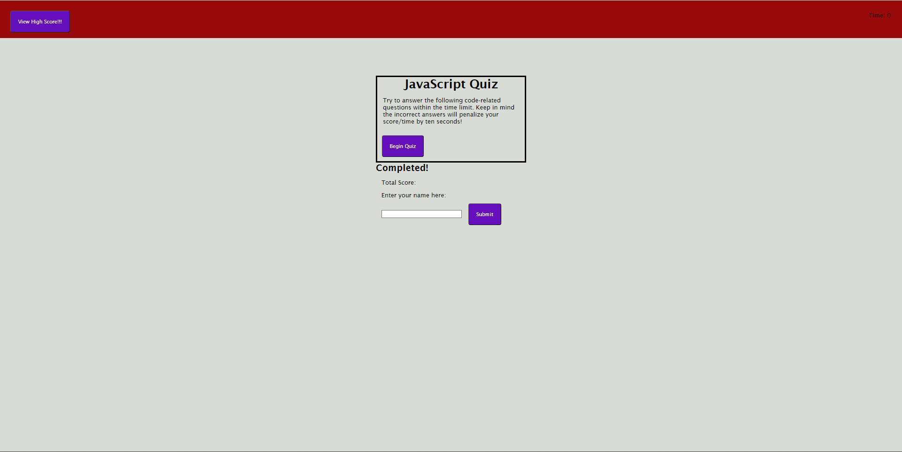

# javascript-quiz 

# First Commit

# User Story

AS A coding boot camp student
I WANT to take a timed quiz on JavaScript fundamentals that stores high scores
SO THAT I can gauge my progress compared to my peers

# Acceptance Criteria

GIVEN I am taking a code quiz
WHEN I click the start button
THEN a timer starts and I am presented with a question
WHEN I answer a question
THEN I am presented with another question
WHEN I answer a question incorrectly
THEN time is subtracted from the clock
WHEN all questions are answered or the timer reaches 0
THEN the game is over
WHEN the game is over
THEN I can save my initials and score

# Mock-Up

# I Learned...
    Showed me the basic breakdown of how query selectors works. I learned about functions and arrays. Definitely need to improve on my understanding of JavaScript.

# Challenges
    The biggest challange is understanding how to use the funtions in order to complete the task needed.